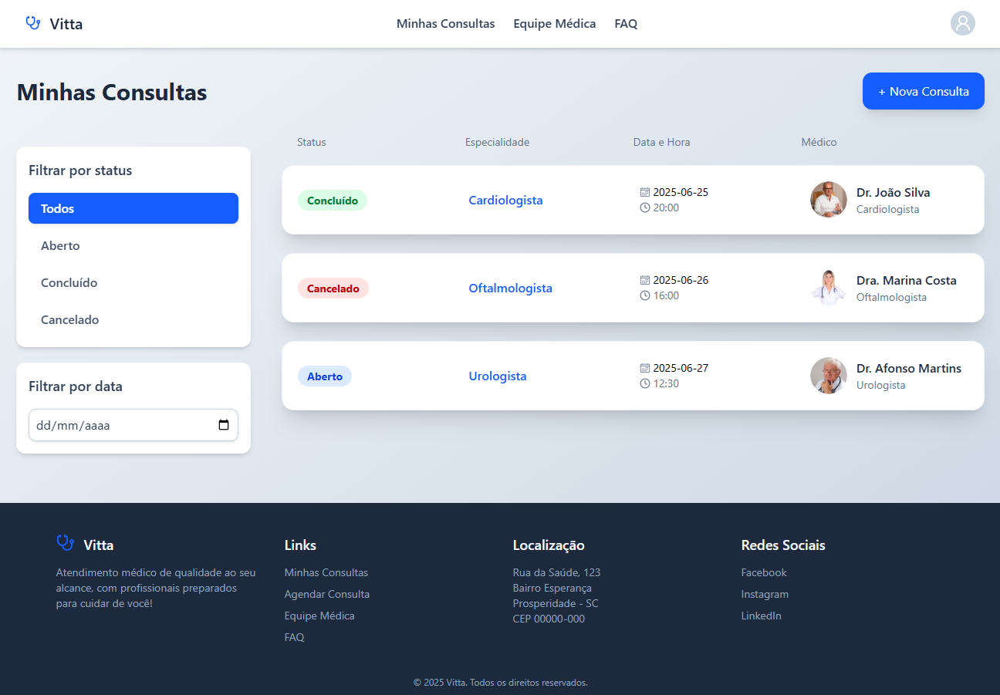
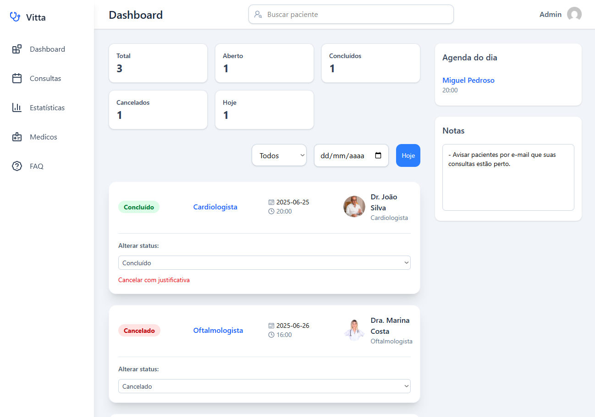

# Painel de Agendamentos - Vitta

Sistema de agendamentos que simula um fluxo real de usuários e administradores em um painel web com autenticação e integração com Firebase.

----

### Painel do Usuário

Acesse em: (https://vitta.vercel.app)

### Painel do Admin

Acesse em: (https://vitta.vercel.app/admin)

### 🔐 Acesso ao Painel do Admin
Use as credenciais abaixo para acessar:

- **Usuário**: teste@teste.com
- **Senha**: teste123


----

## Funcionalidades

### Painel do Usuário

- Acesso com autenticação via e-mail e senha.
- Visualização dos agendamentos disponíveis.
- Agendamento de horários com restrições de disponibilidade.
- Edição ou cancelamento de agendamentos futuros.
- Interface amigável e responsiva.

### Painel do Administrador

- Acesso restrito via autenticação.
- Visualização em tempo real dos agendamentos feitos por todos os usuários.
- Edição do status dos agendamentos (confirmado, pendente, cancelado).
- Controle e atualização dos dados diretamente no Firestore.
- Painel exclusivo com indicadores e painel de controle.

----

## Tecnologias utilizadas

- **React + TypeScript** — Estrutura robusta e tipagem segura para melhor escalabilidade do front-end.
- **Firebase** (Authentication & Firestore) — Backend serverless para autenticação de usuários e persistência em tempo real dos dados.
- **React Router Dom** — Navegação protegida por rotas privadas, controlando o acesso por tipo de usuário.
- **Tailwind CSS** — Estilização moderna, responsiva e com produtividade elevada.
- **React Hooks** — `useState`, `useEffect`, `useCallback` e `useMemo` utilizados para performance e organização de estado.

----

## Estrutura do Projeto

```bash
src/
│
├── components/         # Componentes reutilizáveis (Botões, Inputs, Cards, etc)
├── pages/              # Páginas principais (Login, Dashboard, Admin, etc)
├── services/           # Configuração do Firebase
├── routes/             # Rotas protegidas e públicas
├── types/              # Tipagens globais e interfaces
└── utils/              # Funções auxiliares (formatadores, validadores, etc)
```

---- 

## Como executar localmente

  ### 1.Clone o repositório

  ```bash
  git clone https://github.com/seu-usuario/painel-agendamentos-vitta.git
  cd painel-agendamentos-vitta
  ```
  ### 2.Instale as dependências

  ```bash
  npm install
  ```

  ### 3.Configure o Firebase
  Crie um projeto no Firebase e insira as suas credenciais no arquivo:

  ```bash
  src/services/firebase.ts
  ```

  ### 4.Inicie o projeto

  ```bash
  npm run dev
  ```

----

## Diferenciais

  - Rotas protegidas por autenticação e tipo de usuário.
  - Atualização em tempo real com Firestore.
  - Interface responsiva adaptada para mobile e desktop.
  - Código organizado, limpo e comentado com foco em boas práticas.
  - Flexível e pronto para escalar com novos recursos (notificações, filtros, dashboards por data, etc).

----

## Autora
Feito com muito ☕ por [Poliana Bozzano](https://github.com/polibozzano)

----

## Licença
Este projeto está sob a licença MIT. Veja o arquivo LICENSE para mais detalhes.

